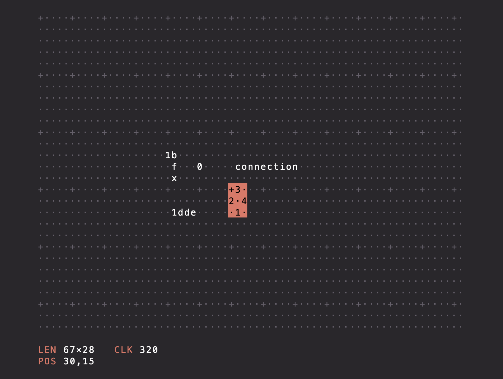

# Text Console using HtmlCanvas

In a nutshell, it allows one to do this something like this:

In other words, to simulate a text-based console, with a cursor, selection and copy&paste. Useful for simple retro UIs.
